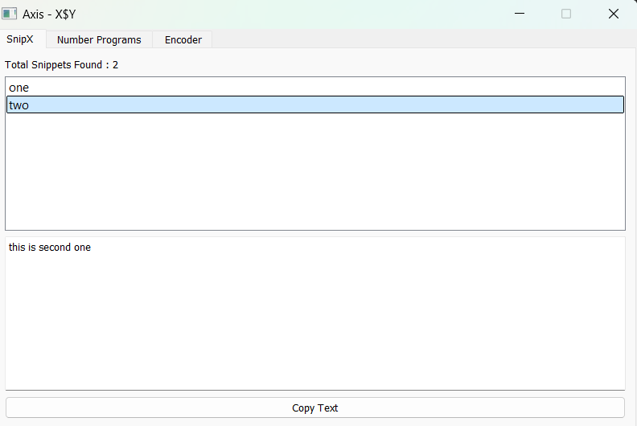
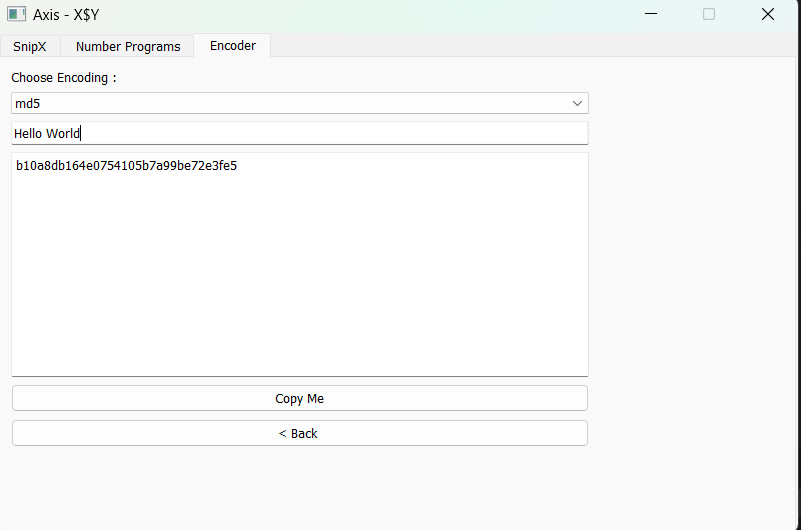
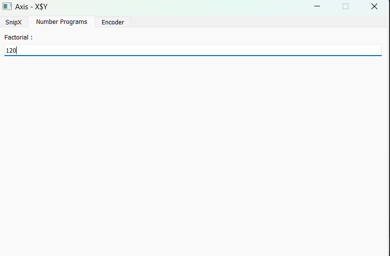
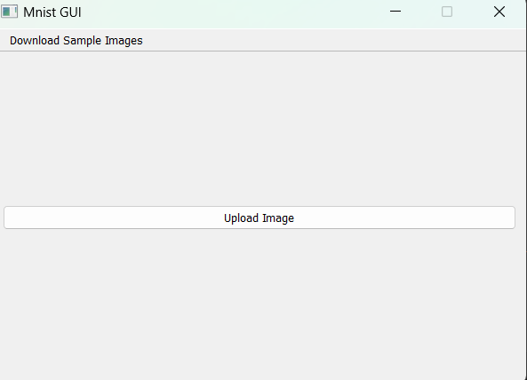
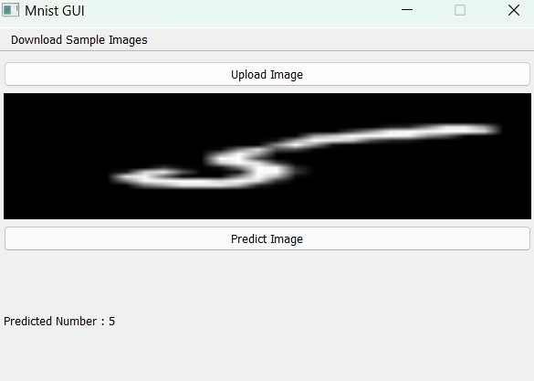
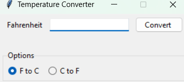
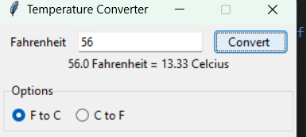

# Python Scripts 

Contains scripts of various kinds / softwares / techniques and much more 

## - Axis Code 

A python written pyqt5 application for saving and getting quick snippets 

## - Mnist GUI 

A python written PYQT5 application for predicting handwritten images via tensorlfow model 

## - Tkinter Switch Between Frames 

A python developed Tkinter frame for switching b/w pages 

  <video src="https://raw.githubusercontent.com/Rishabh-creator601/Python-Scripts/blob/master/media/tk_temp.mp4" type="video/mp4" width="320" height="240" />

## - Tk Image Slider
A python developed Tkinter for sliding images 

 <video src="https://raw.githubusercontent.com/Rishabh-creator601/Python-Scripts/blob/master/media/tk_image_slider.mp4" type="video/mp4" width="320" height="240" />

